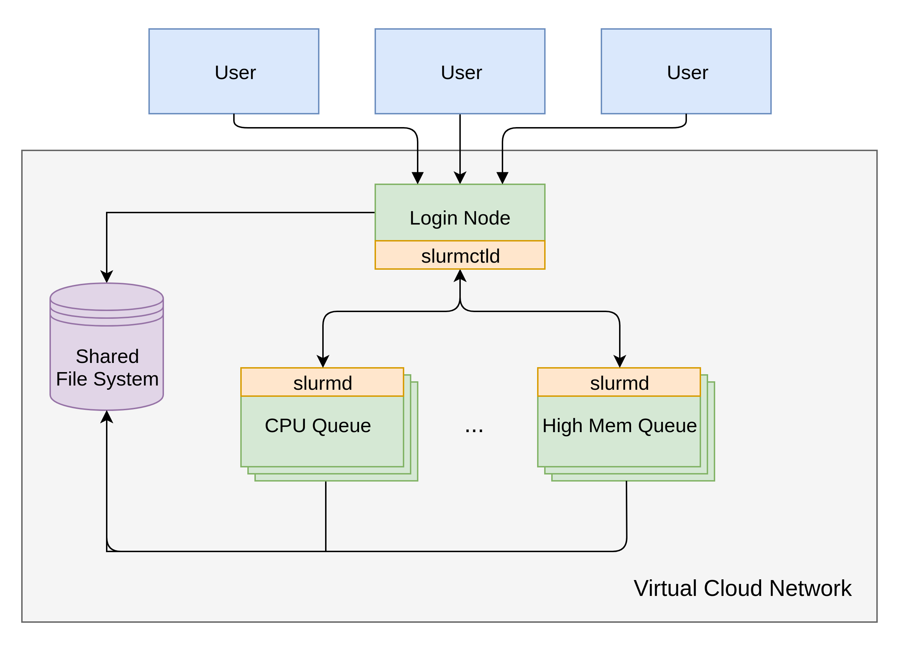

System architecture
===================

An HPC cluster is a collection of many tightly couple
nodes that work together to accomplish a task. Such cluster
is made up of worker nodes(typically hundreds) that are used
for computation and a few login nodes, which allocated tasks
to worker nodes and manage the cluster. All the nodes are
connected to a shared file-system and communicate through
an internal network.

To schedule tasks to worker nodes, a workload management
system must be used. Slurm is one of the most widely
used workload manager, with the responsibility of managing
tasks and resources in a cluster. A typical Slurm architecture
involves

#. **slurmctld deamon** running on the login nodes. Its responsibility includes allocating and monitoring cluster resources and managing how jobs are launched on worker nodes
#. **slurmd deamon** running on the worker nodes. Its responsibility is to communicate with the slurmctld deamon

The figure bellow shows a high-level view of the system architecture.

