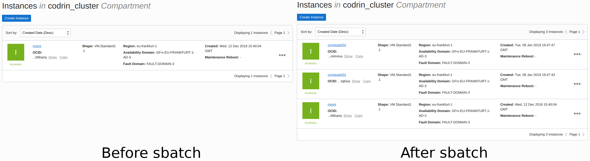

.. scalablecluster documentation master file, created by
   sphinx-quickstart on Mon Jan  7 21:06:45 2019.
   You can adapt this file completely to your liking, but it should at least
   contain the root `toctree` directive.

Scalable Cluster in the Cloud
=============================

.. toctree::
   :maxdepth: 2

   architecture
   initial_setup
   slurm
   mpi

Welcome to Scalable Cluster in the Cloud documentation. This project is an \
extension to Cluster in the Cloud found at: https://cluster-in-the-cloud.readthedocs.io/en/latest/index.html

Intro to Cluster in the Cloud
-----------------------------

The University of Bristol Advanced Computing Research
Centre has developed an open-source project, called Cluster in the Cloud, for the creation
and management of computing clusters hosted in the cloud.
It is currently the only such project that supports hosting
on the Oracle Cloud. This implementation allows building
a homogeneous clusters of a predefined size. The cluster is
self-managed, stopping idle nodes and starting them again if
they are needed. This management system is intended to allow
using the system on a pay as you use basis. However, while
most VM and Bare Metal instances are not being charged
while stopped, DenseIO nodes are. Furthermore, the storage
associated with the compute nodes is still being charged even
if the nodes are stopped.

Motivation: Why Scalable Cluster in the cloud?
----------------------------------------------

This guide shows how Cluster in the Cloud can be extended to create an
infinitely scalable heterogenous compute cluster, that is not of a predefined size,
but can automatically grow or shrink in size
depending on system load.

In appearance, the system looks like a large heterogeneous compute cluster with
multiple execute queues::

    [codrin@mgmt ~]$ sinfo
    PARTITION AVAIL  TIMELIMIT  NODES  STATE NODELIST
    compute      up   infinite     20   idle compute[001-020]
    highmem      up   infinite      3   idle highmem[001-003]
    highcpu*     up   infinite      3   idle highcpu[001-003]

Behind the scenes, Oracle compute
instances are created and destroyed on-they-fly depending on
cluster utilization. By dynamically creating and destroying
instances, this process avoids paying for unused resources.
Furthermore, compared to the existing approach, this implementation does not need to spin-up the whole cluster to present
a close-to-infinite capacity. For submitting the following job::

    [codrin@mgmt ~]$ sbatch mpisubmit

No compute nodes are available, so the management node will schedule the job and
create two instances.

