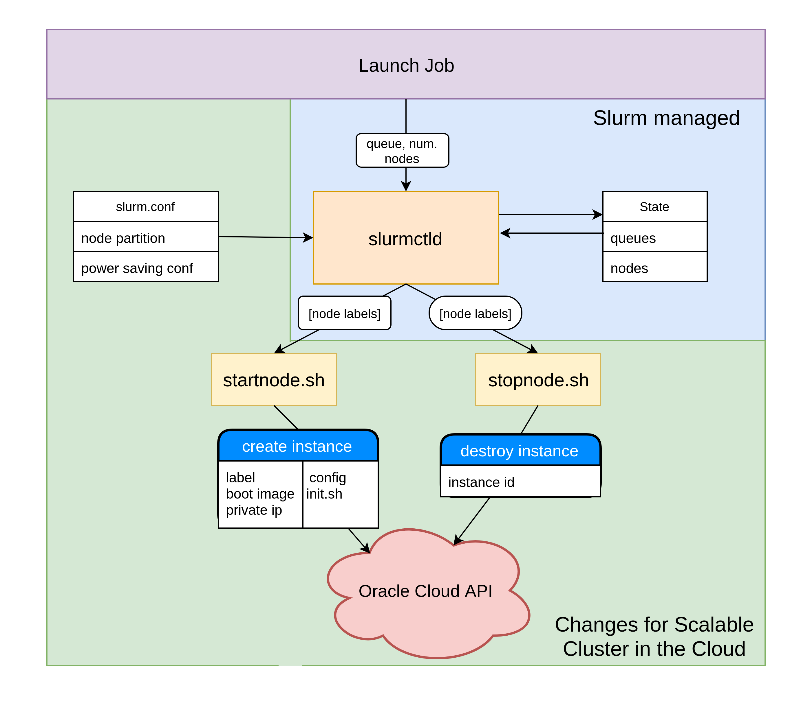

Workload Manager level - Slurm
==============================

The figure bellow shows the major components that have been
changed in this project in order to create a scalable heterogeneous
cluster in the cloud. **slurm.conf** was changed to present to
**slurmctld** different types of queues with very large number of nodes

The system interacts with Slurm power saving mechanism
to achieve the automatic growing and shrinking behaviour
for the cluster. This was acheived my modifying the **startnode.sh** and
**stopnode.sh** nodes.

Finally, **/etc/hosts** was modified to trick Slurm the nodes in **slurm.conf**
are connected to the network.

slurm.conf
----------

The **slurm.conf** file is used for cluster resource management
configuration and defines the grouping of nodes into partitions.
This file sits on the shared file system, being read by all
nodes in the cluster. It is this file that can be configured to
present to Slurm, and in turn to the user, a multitude of queues
with practically infinite amounts of available nodes

Extract from **slurm.conf** (found in /mnt/shared/apps/slurm/slurm.conf)::

    ...

    # ELASTIC
    ResumeProgram=/usr/local/bin/startnode
    SuspendProgram=/usr/local/bin/stopnode
    SuspendTime=60
    ResumeTimeout=600
    SuspendTimeout=60

    ...

    # COMPUTE NODES
    NodeName=compute001 State=IDLE SocketsPerBoard=1 \
    CoresPerSocket=1 ThreadsPerCore=2 RealMemory=6700

    NodeName=compute002 State=IDLE SocketsPerBoard=1 \
    CoresPerSocket=1 ThreadsPerCore=2 RealMemory=6700

    NodeName=compute003 State=IDLE SocketsPerBoard=1 \
    CoresPerSocket=1 ThreadsPerCore=2 RealMemory=6700

    ...

    NodeName=compute100 State=IDLE SocketsPerBoard=1 CoresPerSocket=1
    ThreadsPerCore=2 RealMemory=6700

    # PARTITIONS
    PartitionName=compute Nodes=compute[001-100] MaxTime=INFINITE \
    State=UP Default=True OverSubscribe=NO

    ...

stopnode.sh
-----------
Slurm places nodes in a power-saving mode after they have
been idle for a configured amount of time. This is achieved by
the slurmctld deamon calling a script(**stopnode.sh**) to power
down the nodes. This file was been modified to destroys nodes
and their associated boot volumes if they have been idle for the
configured amount of time. To showcase this behaviour, this
was set to 2 minutes. Such measure prevents being charged
for un-utilized resources.

Simplified extract from **stopnode.sh**::

    #get the list of nodes
    hosts=$(scontrol show hostnames $1)

    #destroy instances
    for host in ${hosts}
    do
      id = get_instance_id(host)
      oci compute instance terminate --force --instance-id="${id}"
    fi
    done

startnode.sh
------------

When a user launches a new job, the **slurmctld** deamon
check for available nodes. Nodes ready to run the
job are selected. If there are not enough ready nodes, the
**slurmctld** selects nodes in power-saving mode and calls a
script(**startnode.sh**) to power them on.

In our case, nodes in power saving mode are non-existent, so startnode.sh was
edited to creates new instances. Simplified extract from **startnode.sh**::

    #get the list of nodes
    hosts=$(scontrol show hostnames $1)

    #create instances
    for host in ${hosts}
    do
      instance_id=`python /usr/local/bin/createCustomInstance.py ${host}`
      sleep 2
    done

    #wait for instances to be in ready state and configured

    #mark nodes for Slurm as ready to begin the task
    for host in ${hosts}
    do
      scontrol update nodename=${host} nodehostname=${host} state=Resume
    done

Each instances is passed the following arguments:
 * its associated label(e.g. compute005)
 * a shape (e.g. VM.Standard1.1 for computer, VM.Standard2.1 for highmem)
 * a private IP address
 * an initialization script

The initialization script is passed for the software configuration
of the newly created nodes. This includes: connecting to the
shared file system, creating users, installing and configuring
Slurm, starting required processes as well as opening up ports
to allow the communication between the slurmd deamon on
the compute node and the slurmctld deamon on the management node.

Extract from simplified initialization script::

    #mount the file system
    yum install -y nfs-utils
    mkdir -p /mnt/shared
    mount 10.1.0.56:/shared /mnt/shared

    #create users
    useradd slurm -u 1001 --home /home/slurm
    useradd codrin -u 1002 --home /mnt/shared/home/codrin

    #install Slurm and dependencies
    cd /mnt/shared/
    yum-config-manager --add-repo file:/mnt/shared/apps/slurm/RPMS/x86_64
    yum install -y --nogpgcheck slurm-slurmd slurm-libpmi munge
    mkdir /etc/slurm
    mkdir /var/log/slurm/
    mkdir /var/spool/slurmd
    chown slurm:slurm /var/spool/slurmd

    #configure slurm

    #open up ports for Slurm
    firewall-cmd --permanent --add-port=6817-6818/tcp
    firewall-cmd --add-port=6817-6818/tcp

    #start slurm and dependency
    systemctl start munge
    systemctl start slurmd

A custom boot image has been created from a
configured node to speed up this process. The required time
to create new nodes is 4 minutes without using a custom boot
image and under 2 minutes for using the custom boot image.

/etc/hosts
----------

**/etc/hosts** was modified to trick Slurm the nodes in **slurm.conf**
are connected to the network. Without this change, Slurm would not have added the
nodes from **slurm.conf** into the coresponding partitions, thinking they are faulty/non-existent.

Extract from **/etc/hosts**::

    127.0.0.1   localhost localhost.localdomain localhost4 localhost4.localdomain4
    ::1         localhost localhost.localdomain localhost6 localhost6.localdomain6
    10.1.0.201 compute001.subnetad3.clustervcn.oraclevcn.com compute001
    10.1.0.202 compute002.subnetad3.clustervcn.oraclevcn.com compute002
    10.1.0.203 compute003.subnetad3.clustervcn.oraclevcn.com compute003
    10.1.0.204 compute004.subnetad3.clustervcn.oraclevcn.com compute004
    ...
    10.1.0.220 compute004.subnetad3.clustervcn.oraclevcn.com compute020
    10.1.0.80 mgmt.subnetad3.clustervcn.oraclevcn.com mgmt
